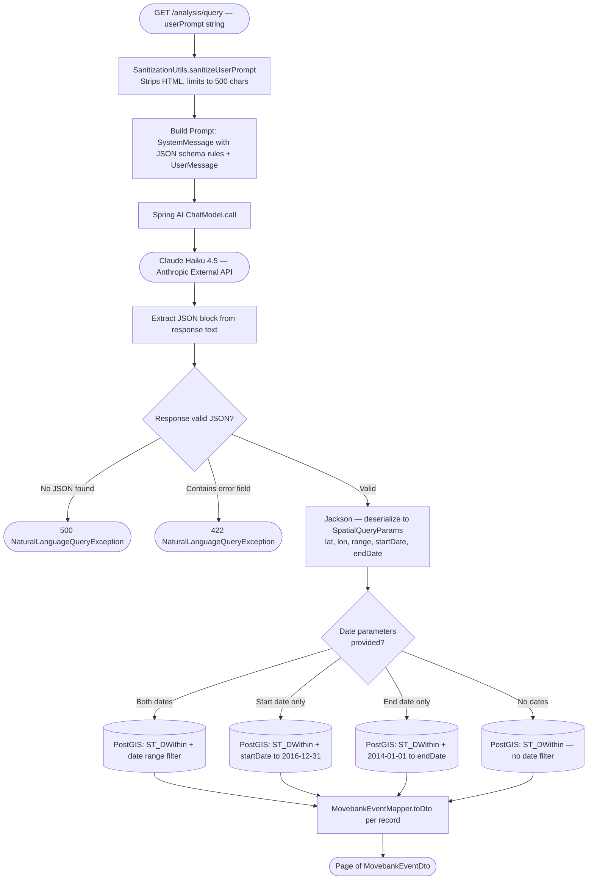
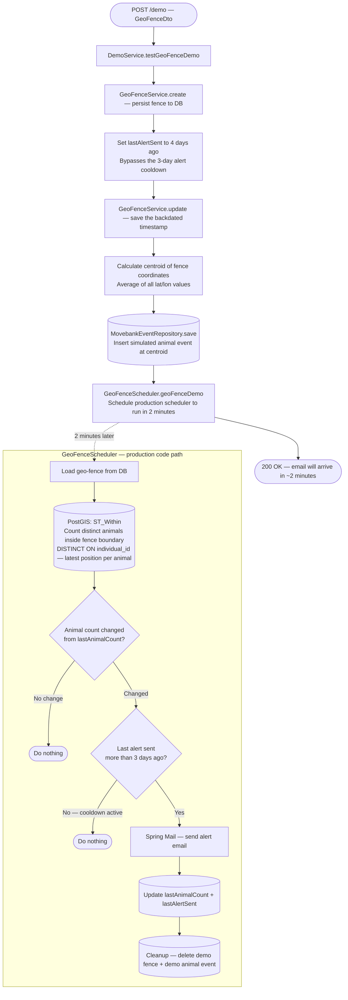

# WildTrack Code Flow

Traces every API call through the class layers. Use this to understand what code runs when an HTTP request comes in.

**Layer order:** Controller → Service → Repository / External API → Response

---

## MovebankController  `BASE: /api/v1/events`

```mermaid
flowchart TD

    subgraph getAll["GET /events"]
        A1(["Request"]) --> A2["MovebankEventService.findAll"]
        A2 --> A3[("MovebankEventRepository.findAll")]
        A3 --> A4["MovebankEventMapper.toDto per record"]
        A4 --> A5(["Page of MovebankEventDto"])
    end

    subgraph getById["GET /events/{id}"]
        B1(["Request"]) --> B2["MovebankEventService.findById"]
        B2 --> B3[("MovebankEventRepository.findById")]
        B3 --> B4{"Found?"}
        B4 -->|Yes| B5["MovebankEventMapper.toDto"]
        B4 -->|No| B6(["404 ResourceNotFoundException"])
        B5 --> B7(["MovebankEventDto"])
    end

    subgraph updateDb["POST /events/updateDatabase"]
        C1(["Request"]) --> C2["MovebankEventService.updateDatabase"]
        C2 --> C3["MovebankClient.getData — study ID 19186107"]
        C3 --> C4(["Movebank External API"])
        C4 --> C5["Parse CSV with OpenCSV"]
        C5 --> C6["Check null fields — warn log per record"]
        C6 --> C7["Split into 20 batches — Java Virtual Threads"]
        C7 --> C8{"Duplicate? existsByTimestamp\nAndLocationAndIndividualId..."}
        C8 -->|New record| C9[("MovebankEventRepository.save")]
        C8 -->|Already exists| C10["Skip — increment dup counter"]
        C9 & C10 --> C11{"Batch result"}
        C11 -->|0 failures| C12(["200 FULL_SUCCESS"])
        C11 -->|80% or more saved| C13(["207 PARTIAL_SUCCESS"])
        C11 -->|Under 80% saved| C14(["500 FAILURE"])
    end

    subgraph byBox["GET /events/allDataPointsByBox"]
        D1(["Request: minLat, maxLat, minLon, maxLon"]) --> D2["MovebankEventService.allDataPointsByBox"]
        D2 --> D3[("PostGIS: ST_Within + ST_MakeEnvelope")]
        D3 --> D4["MovebankEventMapper.toDto per record"]
        D4 --> D5(["Page of MovebankEventDto"])
    end

    subgraph byRange["GET /events/allDataPointsByRange"]
        E1(["Request: lat, lon, range"]) --> E2["MovebankEventService.allDataPointsByRange"]
        E2 --> E3[("PostGIS: ST_DWithin")]
        E3 --> E4["MovebankEventMapper.toDto per record"]
        E4 --> E5(["Page of MovebankEventDto"])
    end
```

---

## GeoFenceController  `BASE: /api/v1/geoFence`

```mermaid
flowchart TD

    subgraph gfGetAll["GET /geoFence"]
        A1(["Request"]) --> A2["GeoFenceService.findAll"]
        A2 --> A3[("GeoFenceRepository.findAll")]
        A3 --> A4["GeoFenceMapper.toDto per record"]
        A4 --> A5(["Page of GeoFenceDto"])
    end

    subgraph gfGetById["GET /geoFence/{id}"]
        B1(["Request"]) --> B2["GeoFenceService.findById"]
        B2 --> B3[("GeoFenceRepository.findById")]
        B3 --> B4{"Found?"}
        B4 -->|Yes| B5["GeoFenceMapper.toDto"]
        B4 -->|No| B6(["404 ResourceNotFoundException"])
        B5 --> B7(["GeoFenceDto"])
    end

    subgraph gfCreate["POST /geoFence"]
        C1(["Request: GeoFenceDto"]) --> C2["SanitizationUtils.sanitizeString — name + username"]
        C2 --> C3["GeoFenceService.create"]
        C3 --> C4["GeoFenceMapper.toEntity — coordinate list converted to PostGIS Polygon"]
        C4 --> C5[("GeoFenceRepository.save")]
        C5 --> C6["GeoFenceMapper.toDto"]
        C6 --> C7(["201 Created — GeoFenceDto"])
    end

    subgraph gfUpdate["PUT /geoFence/{id}"]
        D1(["Request: id + GeoFenceDto"]) --> D2["SanitizationUtils.sanitizeString — name + username"]
        D2 --> D3["GeoFenceService.update"]
        D3 --> D4[("GeoFenceRepository.findById")]
        D4 --> D5{"Found?"}
        D5 -->|Yes| D6["GeoFenceMapper.updateEntityFromDto"]
        D5 -->|No| D7(["404 ResourceNotFoundException"])
        D6 --> D8(["200 OK — GeoFenceDto"])
    end

    subgraph gfDelete["DELETE /geoFence/{id}"]
        E1(["Request: id"]) --> E2["GeoFenceService.delete"]
        E2 --> E3[("GeoFenceRepository.existsById")]
        E3 --> E4{"Found?"}
        E4 -->|Yes| E5[("GeoFenceRepository.deleteById")]
        E4 -->|No| E6(["404 ResourceNotFoundException"])
        E5 --> E7(["204 No Content"])
    end
```

---

## NaturalLanguageQueryController  `BASE: /api/v1/analysis`

---

## DemoController  `BASE: /api/v1/demo`

---

## Background Schedulers

These run independently of HTTP requests on a nightly cron schedule. Disabled in production since the dataset (2014–2016) is historical and produces no new events.

| Scheduler | Trigger | What it does |
|-----------|---------|--------------|
| `UpdateDatabaseScheduler` | Nightly cron | Calls `MovebankEventService.updateDatabase()` — identical flow to `POST /events/updateDatabase` above |
| `GeoFenceScheduler` | Nightly cron | Checks all geo-fences via PostGIS, fires email alerts on count changes — the same scheduler the demo endpoint triggers manually |
